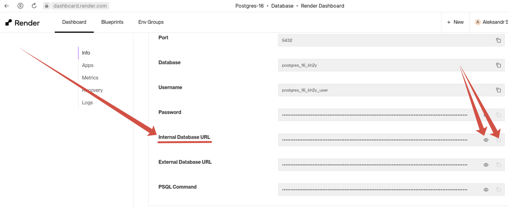

# Развертывание проекта на render.com
Вам нужно выполнить следующие шаги:

- зарегистрируйтесь на [render.com](https://dashboard.render.com/register) со своей учетной записью GitHub
 


## Создание веб-сервиса для проекта
- создайте новый веб-сервис


- для этого выберите свой публичный репозиторий на GitHub


- далее заполните поля:
- `Имя`


- `Команда сборки` - *для этой цели в проекте есть файл* `.build.sh`
- `Команда запуска`
- и не забудьте указать бесплатный тарифный план


- еще нужно создать несколько переменных среды `Environment Variables`


### Подробнее об этих переменных
```CREATE_SUPERUSER = True``` - нужна для создания суперпользователя в административной панели.
Наличие этой переменной необходимо для выполнения скрипта `build.sh`, который содержит в себе код: 
```
if [[ $CREATE_SUPERUSER ]];
then
  python world_champ_2022/manage.py createsuperuser --no-input
fi
``` 
Эта переменная должна использоваться при первом развертывании проекта. Суперпользователь будет создан автоматически.
Проверьте свой веб-сайт, чтобы убедиться в этом. Если все в порядке, то перед следующим развертыванием вы можете удалить переменную из вашей среды, чтобы фрагмент в build.sh не выполнялся при ваших следующих сборках.

`DATABASE_URL` - сюда мы передаем `Internal Database URL` для подключения базы данных на сервисе Render.

`DEBUG = False` - необходимо для отключения отладочного режима приложения.

`DJANGO_SUPERUSER_EMAIL` - email для создания суперпользователя.

`DJANGO_SUPERUSER_PASSWORD` - пароль для создания суперпользователя.

`DJANGO_SUPERUSER_USERNAME` - имя для создания суперпользователя.

`ROLLBAR_ACCESS_TOKEN` - (опционально) нужен для отслеживания ошибок приложения, если вы будете  использовать Rollbar.

`SECRET_KEY` - `Secret Key`, который передается в settings.py вашего проекта Django.

## Создание базы данных.
- следующий шаг - создание базы данных PostgreSQL.


- вам также нужно заполнить поле `Name`, выбрать нужную версию `PostgreSQL Version` и выбрать бесплатный тарифный план.
После этого нажмите на кнопку `Create Database`.

- теперь в настройках базы данных нам нужно получить `Internal Database URL`



- полученный URL мы сохраняем в переменную `DATABASE_URL` (смотри выше).
- после этого переходим в `Dashboard`, выбираем наш веб-сервер с проектом, и в открывшемся окне нажимаем `Manual Deploy`.


- ждём появления записи об успешном развертывании.


- Поздравляю! Вы успешно задеплоили Ваш проект!
